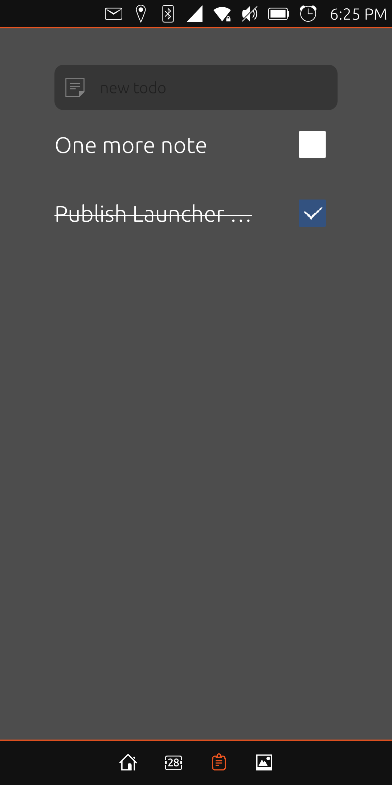

# Launcher modular

A launcher modular for ubuntu touch

  
   
  
  

The “Launcher Modular” lets you quickly view information such as:
- time
- weather
- latest calls
- messages
- upcoming events

It gives quick access to your favorite:
- applications
- contacts

You have the option of adding “Pages” as:
- Agenda
- Notes
- Photos
- RSS feeds

And of course you can launch all your installed applications

### How to build

To build Launcher Modular for Ubuntu Touch devices you do need clickable. Follow install instructions at its repo [here](https://gitlab.com/clickable/clickable).
Once clickable is installed you are ready to go.

1. Fork [Launcher Modular at GitHub](https://github.com/lutin11/launcher-modular) into your own namespace. You may need to open an account with GitHub if not already done.
2. Open a terminal: ctl + alt + t.
3. Clone the repo onto your local machine using git: `git clone git@github.com:lutin11/launcher-modular.git`.
4. Change into Launcher Modular folder: `cd launcher-modular`.
5. build for arm64 arch, run: `clickable build --arch arm64`.
6. develop into ide: `clickable ide`.
7. to launch on phone run clickable: `clickable` or on desktop: `clickable desktop`.
8. to view logs: `clickable logs`

