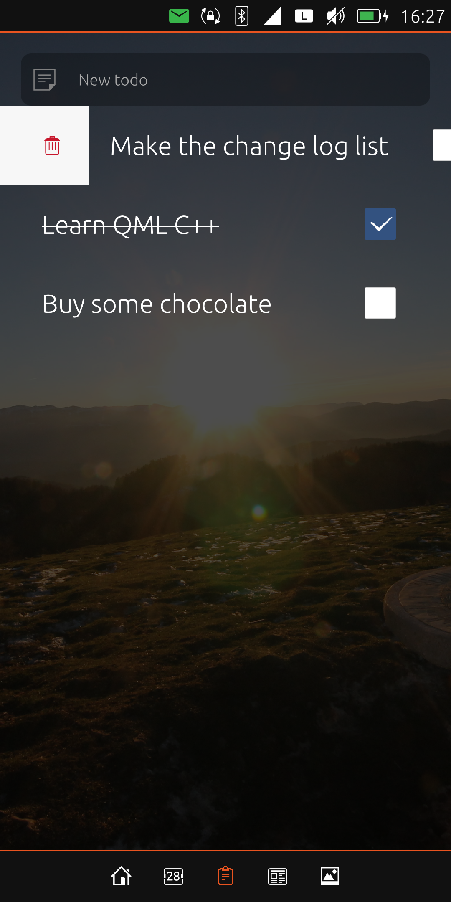
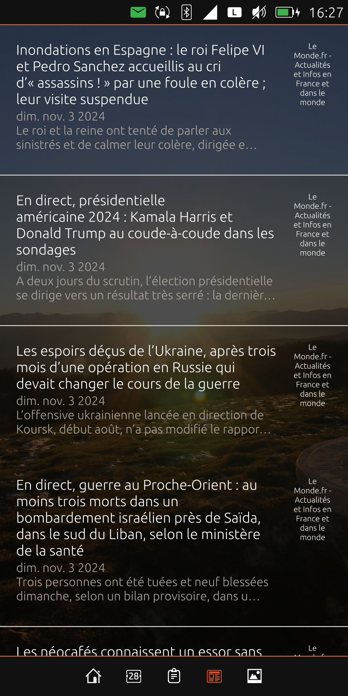
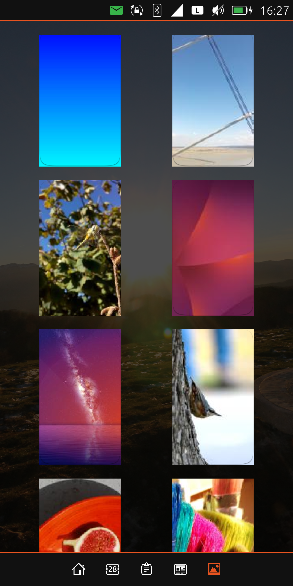
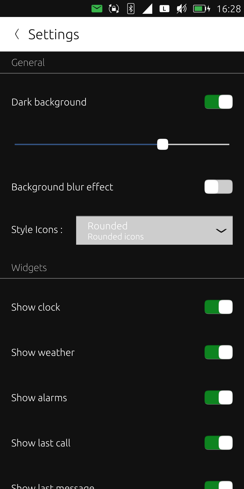
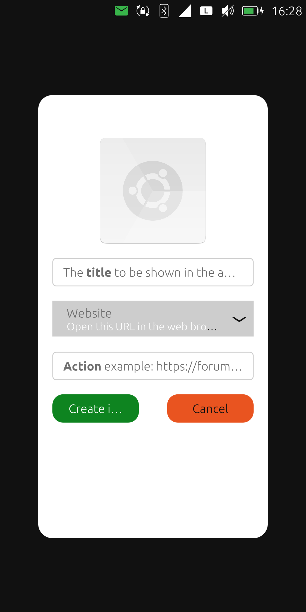
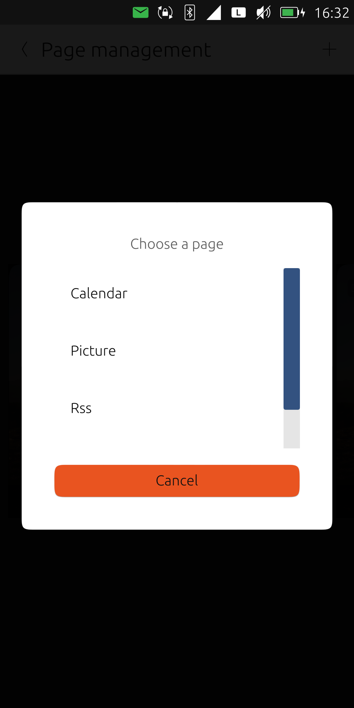
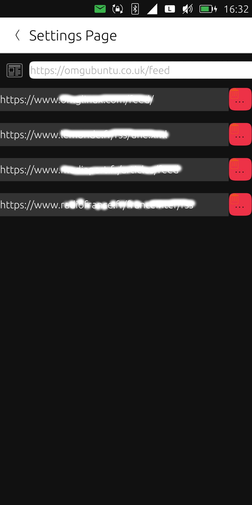

# Launcher modular

A launcher modular for ubuntu touch

<p float="left">
  
   
  
  
  
  
  
  
  
  
  
</p>

### The “Launcher Modular” lets you quickly view information such as:
- time
- weather forecast
- latest calls
- latest messages
- upcoming events

### It gives quick access to your favorite:
- applications
- contacts

### By clicking on a contact's icon, you can call them or send them a message.

### It give you access to all your applications from Ubports, Libertine, Waydroid

### You have the option of adding “Pages” as:
- Agenda
- Todo list
- Photos
- RSS feeds
- Music
- Videos

### The main search bar will search your contacts, applications and the web at the same time

## How to build

To build Launcher Modular for Ubuntu Touch devices you do need clickable. Follow install instructions at its repo [here](https://gitlab.com/clickable/clickable).
Once clickable is installed you are ready to go.

1. Fork [Launcher Modular at GitHub](https://github.com/lutin11/launcher-modular) into your own namespace. You may need to open an account with GitHub if not already done.
2. Open a terminal: ctl + alt + t.
3. Clone the repo onto your local machine using git: `git clone git@github.com:lutin11/launcher-modular.git`.
4. Change into Launcher Modular folder: `cd launcher-modular`.
5. build for arm64 arch, run: `clickable build --arch arm64`.
6. develop into ide: `clickable ide`.
7. to launch on phone run clickable: `clickable` or on desktop: `clickable desktop`.
8. to view logs: `clickable logs`

font used: https://www.keshikan.net/fonts-e.html

### Fom 2.4.0 the branch develop and master have default framework is 24.04
Regarding the version you want to buid on apply one of the following commands:
```
CLICKABLE_FRAMEWORK=ubuntu-touch-24.04-1.x clickable
CLICKABLE_FRAMEWORK=ubuntu-touch-20.04 clickable
CLICKABLE_FRAMEWORK=ubuntu-sdk-16.04 clickable
```

if you switch from framwork you may need to execute the following command:
`docker system prune -a --volumes`

If you are facing errors such as:
```
Architecture set to host arch "amd64"
Cached image has a different base image
Error response from daemon: No such image: clickable/amd64-20.04-amd64:latest
```
run the following command:
```
docker pull clickable/amd64-20.04-amd64:latest
```

## Creating a Custom Page

Launchermodular lets you add custom pages without modifying the application itself. A page is a standalone QML component, accompanied by a few supporting files (settings, icon, background image), following a precise naming convention.

### 1. Location

All custom pages live in:

```
~/.launchermodular/pages/
```

(built-in pages follow the exact same structure, in the app bundle's `pages/` folder — a good reference to look at if needed).

### 2. Expected file structure

For a page named `MyPage` (the name you choose, in `PascalCase`), create:

```
~/.launchermodular/pages/
├── MyPage.qml                  ← main component, shown on the dashboard
└── mypage/                     ← subfolder: lowercase name, no spaces
    ├── Settings.qml            ← settings page (opened from "Page management")
    └── assets/
        ├── icon.svg            ← icon ("Choose a page" list, bottom-bar indicator)
        └── page.png            ← background image shown behind the page's tile
```

**Important points:**
- The subfolder name must be **exactly** the main `.qml` file's name, all lowercase (`MyPage.qml` → `mypage/`). This convention is what links the two together.
- `MyPage.qml` must be placed **directly** in `~/.launchermodular/pages/` (not in the subfolder) — this is the file that actually gets loaded and displayed on the dashboard.
- `icon.svg` must be in SVG format (bitmap formats are not guaranteed to work).

### 3. The main component (`MyPage.qml`)

This is a standard QML component (typically an `Item` or a `Page`), loaded dynamically via `Qt.createComponent()` and inserted into the dashboard (a `SwipeView`, one page per enabled entry). It doesn't need to implement any particular interface: the application simply drives its `visible` property depending on whether it's the currently displayed page or not.

```qml
import QtQuick 2.12

Item {
    id: myPage
    // Your content here
}
```

You can use the same patterns as the application's existing pages (Lomiri.Components imports, access to `launchermodular.settings`, etc.).

### 4. The settings page (`mypage/Settings.qml`)

Opened when the user taps your page in the "Page management" screen (`pageStack.push(...)`). It's a standard `Page` component:

```qml
import QtQuick 2.12
import Lomiri.Components 1.3

Page {
    id: pageSettingsMyPage

    header: PageHeader {
        title: i18n.tr("My Page")
        leadingActionBar.actions: [
            Action {
                iconName: "back"
                onTriggered: pageStack.pop()
            }
        ]
    }

    // Your settings here
}
```

### 5. Storing page-specific settings

Every added page has a `data` field (a free-form JSON object) of its own in the application's page model, automatically persisted across restarts. It's injected into your main component through a property named **`pageData`** (not `data` — see the warning below):

```qml
import QtQuick 2.12

Item {
    id: myPage
    property var pageData: ({})   // receives this page's persisted data

    Component.onCompleted: {
        // pageData.myKey is available here if it was set on a previous run
    }

    // To persist a value: mutate pageData IN PLACE, don't replace it
    function saveSomething(value) {
        pageData.myKey = value   // ✅ correct: picked up automatically on save
        // pageData = {myKey: value}   ❌ wrong: breaks the shared reference with pageModel
    }
}
```

**Why `pageData` and not `data`**: `Item` (and therefore `Page`, `Rectangle`, etc.) already has a built-in `data` property — the list of its children. Declaring a `data` property on your page would collide with it. The field stays named `data` in the application's internal model (to remain consistent with the rest of the codebase); on the page side, it's passed to you under the name `pageData`.

**Why mutate in place rather than reassign**: `pageData` is passed by reference, not copied. If you do `pageData.myKey = value`, the application automatically picks up the current value when it saves settings (no synchronization code to write). If you fully reassign `pageData = {...}`, you create a new object disconnected from the one the application will persist — your change will be lost.

### 6. Adding the page to the application

1. Place the files above in `~/.launchermodular/pages/`.
2. In Launchermodular, open **Page management** (the "+" button, top right).
3. Your page automatically appears in the "Choose a page" list (it's detected as soon as a `.qml` file exists directly in `~/.launchermodular/pages/`) — select it to add it to the dashboard.

No application restart or additional declaration is needed: detection happens by scanning the folder each time "Page management" is opened.

## Créer une page personnalisée

Launchermodular permet d'ajouter des pages personnalisées, sans modifier l'application elle-même. Une page est un composant QML autonome, accompagné de quelques fichiers annexes (réglages, icône, image de fond), suivant une convention de nommage précise.

### 1. Emplacement

Toutes les pages personnalisées vivent dans :

```
~/.launchermodular/pages/
```

(les pages intégrées à l'application suivent exactement la même structure, dans le dossier `pages/` du bundle de l'app — c'est un bon exemple à regarder si besoin).

### 2. Structure de fichiers attendue

Pour une page nommée `MaPage` (le nom que vous choisissez, en `PascalCase`), créez :

```
~/.launchermodular/pages/
├── MaPage.qml                  ← composant principal, affiché sur le tableau de bord
└── mapage/                     ← sous-dossier : nom en minuscules, sans espace
    ├── Settings.qml            ← page de réglages (ouverte depuis "Page management")
    └── assets/
        ├── icon.svg            ← icône (liste "Choose a page", indicateur en bas d'écran)
        └── page.png            ← image de fond affichée derrière la tuile de la page
```

**Points importants :**
- Le nom du sous-dossier doit être **exactement** le nom du fichier `.qml` principal, tout en minuscules (`MaPage.qml` → `mapage/`). C'est cette convention qui relie les deux.
- `MaPage.qml` doit être placé **directement** dans `~/.launchermodular/pages/` (pas dans le sous-dossier) — c'est ce fichier qui sera réellement chargé et affiché sur le tableau de bord.
- `icon.svg` doit être au format SVG (formats bitmap non garantis).

### 3. Le composant principal (`MaPage.qml`)

C'est un composant QML standard (typiquement un `Item` ou un `Page`), chargé dynamiquement via `Qt.createComponent()` puis inséré dans le tableau de bord (un `SwipeView`, une page par entrée activée). Il n'a pas besoin d'implémenter d'interface particulière : l'application se contente de piloter sa propriété `visible` selon qu'il est la page actuellement affichée ou non.

```qml
import QtQuick 2.12

Item {
    id: maPage
    // Votre contenu ici
}
```

Vous pouvez utiliser les mêmes patterns que les pages existantes de l'application (imports Lomiri.Components, accès à `launchermodular.settings`, etc.).

### 4. La page de réglages (`mapage/Settings.qml`)

Ouverte quand l'utilisateur touche votre page dans l'écran "Page management" (`pageStack.push(...)`). C'est un composant `Page` classique :

```qml
import QtQuick 2.12
import Lomiri.Components 1.3

Page {
    id: pageSettingsMaPage

    header: PageHeader {
        title: i18n.tr("Ma Page")
        leadingActionBar.actions: [
            Action {
                iconName: "back"
                onTriggered: pageStack.pop()
            }
        ]
    }

    // Vos réglages ici
}
```

### 5. Stockage des réglages propres à votre page

Chaque page ajoutée possède un champ `data` (objet JSON libre) qui lui est propre dans le modèle de pages de l'application, persisté automatiquement entre les redémarrages. Il est injecté dans votre composant principal via une propriété nommée **`pageData`** (pas `data` — voir la mise en garde ci-dessous) :

```qml
import QtQuick 2.12

Item {
    id: maPage
    property var pageData: ({})   // reçoit le data persisté de cette page

    Component.onCompleted: {
        // pageData.maCle est disponible ici si déjà défini lors d'un lancement précédent
    }

    // Pour persister une valeur : mutez pageData EN PLACE, ne le remplacez pas
    function saveSomething(valeur) {
        pageData.maCle = valeur   // ✅ correct : sera repris automatiquement à la sauvegarde
        // pageData = {maCle: valeur}   ❌ incorrect : casse la référence partagée avec pageModel
    }
}
```

**Pourquoi `pageData` et pas `data`** : `Item` (et donc `Page`, `Rectangle`, etc.) possède déjà nativement une propriété `data` — la liste de ses enfants. Déclarer une propriété `data` dans votre page entrerait en collision avec elle. Le champ reste appelé `data` dans le modèle interne de l'application (pour rester cohérent avec le reste du code) ; côté page, il vous est passé sous le nom `pageData`.

**Pourquoi muter en place plutôt que réassigner** : `pageData` est passé par référence, pas copié. Si vous faites `pageData.maCle = valeur`, l'application récupère automatiquement la valeur à jour au moment de sauvegarder les réglages (aucun code de synchronisation à écrire). Si vous réassignez complètement `pageData = {...}`, vous créez un nouvel objet déconnecté de celui que l'application persistera — la modification sera perdue.

### 6. Ajouter la page dans l'application

1. Placez les fichiers ci-dessus dans `~/.launchermodular/pages/`.
2. Dans Launchermodular, ouvrez **Page management** (bouton "+" en haut à droite).
3. Votre page apparaît automatiquement dans la liste "Choose a page" (elle est détectée dès qu'un fichier `.qml` existe directement dans `~/.launchermodular/pages/`) — sélectionnez-la pour l'ajouter au tableau de bord.

Aucun redémarrage de l'application ni déclaration supplémentaire n'est nécessaire : la détection se fait par scan du dossier à l'ouverture de "Page management".
